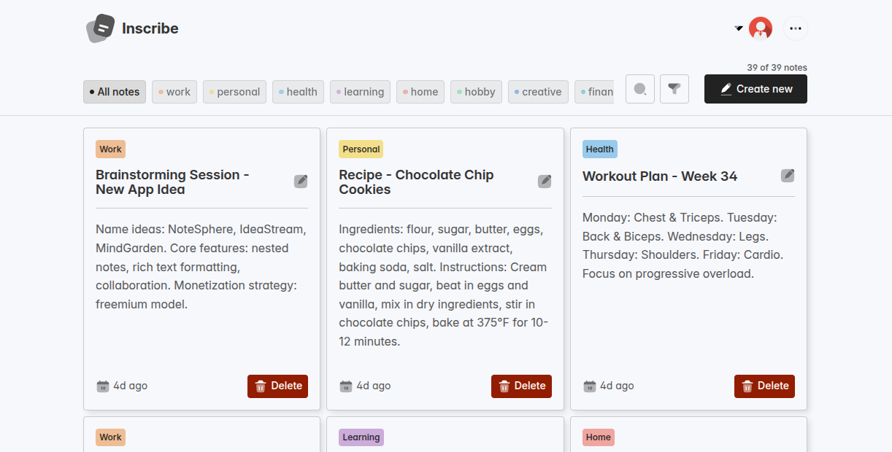

# Inscribe 🖊️

A **mobile-first note-taking web application** that lets users create, update, delete, and organize notes with tags.  
Built with **Node.js, Express.js, and MongoDB** — this project marks my first experience working with a NoSQL database...

---

## ✨ Features

- Create notes with tags for better organization
- View all notes or filter by tag
- Edit and update existing notes
- Delete notes when no longer needed
- RESTful API powered by Express.js
- Data persistence with MongoDB
- Designed with a **mobile-first approach** for responsiveness

---

## 🛠️ Tech Stack

- **Frontend:** HTML, CSS, JavaScript
- **Backend:** Node.js, Express.js
- **Database:** MongoDB

---

## 📦 Installation & Setup

1. Clone the repository:
   ```bash
   git clone https://github.com/your-username/inscribe.git
   cd inscribe
   ```
2. Install dependencies:
   ```bash
   npm install
   ```
3. Create a .env file in the root folder and add:
   ```bash
   PORT=3000
   MONGODB_URI=your_mongodb_connection_string
   ```
4. Start the development server:
   ```bash
   npm start
   ```

## 📸 Screenshots

- #### Desktop View



- #### Mobile View


### 🚀 Future Improvements

- User authentication (sign up & login)
- Rich text editor for better note formatting
- Search and filter improvements
- Dark mode support
